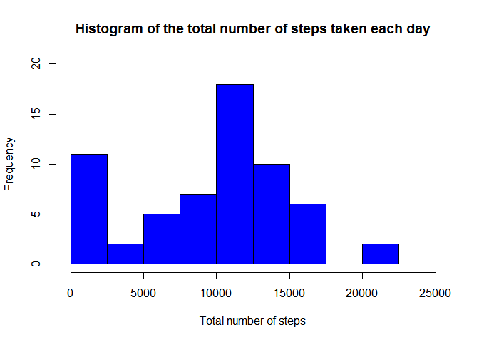
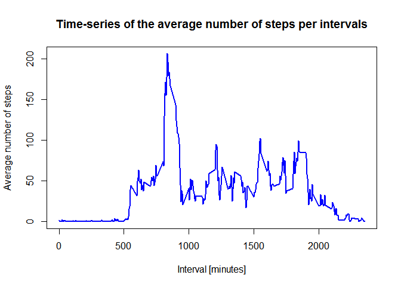
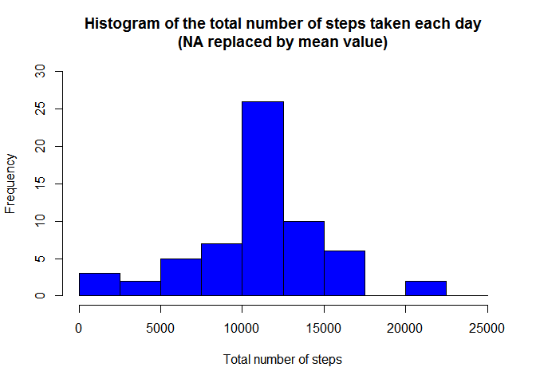
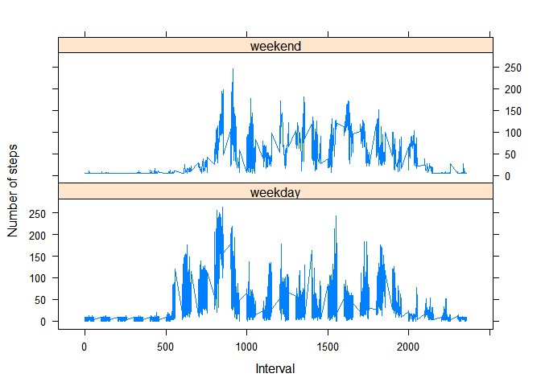

##Synopsis
The purpose of this project was to practice:

* downloading, loading and preprocessing data
* imputing missing values
* interpreting data to answer research questions


# Read Data

```r
activity<-read.csv("activity.csv")
```
#Process Data

```r
# Transform the date attribute to an actual date format
activity$date <- as.POSIXct(activity$date, format="%Y-%m-%d")

# Compute the weekdays from the date attribute
activity <- data.frame(date=activity$date, 
                           weekday=tolower(weekdays(activity$date)), 
                           steps=activity$steps, 
                           interval=activity$interval)

# Compute the day type (weekend or weekday)
activity <- cbind(activity, 
                      daytype=ifelse(activity$weekday == "saturday" | 
                                     activity$weekday == "sunday", "weekend", 
                                     "weekday"))

# Create the final data.frame
activity_processed <- data.frame(date=activity$date, 
                       weekday=activity$weekday, 
                       daytype=activity$daytype, 
                       interval=activity$interval,
                       steps=activity$steps)

head(activity_processed)
```

```
##         date weekday daytype interval steps
## 1 2012-10-01  monday weekday        0    NA
## 2 2012-10-01  monday weekday        5    NA
## 3 2012-10-01  monday weekday       10    NA
## 4 2012-10-01  monday weekday       15    NA
## 5 2012-10-01  monday weekday       20    NA
## 6 2012-10-01  monday weekday       25    NA
```
# Histogram of Total numbers of steps taken each day

```r
# Compute the total number of steps each day
total_steps_per_day <- aggregate(activity_processed$steps, by=list(activity_processed$date), FUN=sum, na.rm=TRUE)

# Rename the attributes
names(total_steps_per_day) <- c("date", "total")
head(total_steps_per_day)
```

```
##         date total
## 1 2012-10-01     0
## 2 2012-10-02   126
## 3 2012-10-03 11352
## 4 2012-10-04 12116
## 5 2012-10-05 13294
## 6 2012-10-06 15420
```

```r
hist(total_steps_per_day$total, 
     breaks=seq(from=0, to=25000, by=2500),
     col="blue", 
     xlab="Total number of steps", 
     ylim=c(0, 20), 
     main="Histogram of the total number of steps taken each day")
```

<!-- -->

#Mean and median number of steps taken each day

```r
mean(total_steps_per_day$total)
```

```
## [1] 9354.23
```

```r
median(total_steps_per_day$total)
```

```
## [1] 10395
```
#Time Series plot of Number of steps taken per day

```r
# Compute the means of steps accross all days for each interval
mean_data <- aggregate(activity_processed$steps, 
                       by=list(activity_processed$interval), 
                       FUN=mean, 
                       na.rm=TRUE)

# Rename the attributes
names(mean_data) <- c("interval", "mean")
head(mean_data)
```

```
##   interval      mean
## 1        0 1.7169811
## 2        5 0.3396226
## 3       10 0.1320755
## 4       15 0.1509434
## 5       20 0.0754717
## 6       25 2.0943396
```

```r
# Compute the time series plot
plot(mean_data$interval, 
     mean_data$mean, 
     type="l", 
     col="blue", 
     lwd=2, 
     xlab="Interval [minutes]", 
     ylab="Average number of steps", 
     main="Time-series of the average number of steps per intervals")
```

<!-- -->
#The 5-minute interval that, on average, contains the maximum number of steps

```r
# We find the position of the maximum mean
max_pos <- which(mean_data$mean == max(mean_data$mean))

# We lookup the value of interval at this position
max_interval <- mean_data[max_pos, 1]
print(max_interval)
```

```
## [1] 835
```
#Code to describe and show a strategy for imputing missing data

```r
#Calculate and report the total number of missing values in the dataset (i.e. the total number of rows with NA's)
NA_count <- sum(is.na(activity_processed$steps))
print(NA_count)
```

```
## [1] 2304
```

```r
#Devise a strategy for filling in all of the missing values in the dataset. The strategy does not need to be sophisticated. For example, you could use the mean/median for that day, or the mean for that 5-minute interval, etc.
# Find the NA positions
na_pos <- which(is.na(activity_processed$steps))

# Create a vector of means
mean_vec <- rep(mean(activity_processed$steps, na.rm=TRUE), times=length(na_pos))

#Create a new dataset that is equal to the original dataset but with the missing data filled in
activity_processed[na_pos, "steps"] <- mean_vec
head(activity_processed)
```

```
##         date weekday daytype interval   steps
## 1 2012-10-01  monday weekday        0 37.3826
## 2 2012-10-01  monday weekday        5 37.3826
## 3 2012-10-01  monday weekday       10 37.3826
## 4 2012-10-01  monday weekday       15 37.3826
## 5 2012-10-01  monday weekday       20 37.3826
## 6 2012-10-01  monday weekday       25 37.3826
```
#Histogram of the total number of steps taken each day after missing values are imputed

```r
sum_data <- aggregate(activity_processed$steps, by=list(activity_processed$date), FUN=sum)

# Rename the attributes
names(sum_data) <- c("date", "total")

# Compute the histogram of the total number of steps each day
hist(sum_data$total, 
     breaks=seq(from=0, to=25000, by=2500),
     col="blue", 
     xlab="Total number of steps", 
     ylim=c(0, 30), 
     main="Histogram of the total number of steps taken each day\n(NA replaced by mean value)")
```

<!-- -->

```r
mean(sum_data$total)
```

```
## [1] 10766.19
```

```r
median(sum_data$total)
```

```
## [1] 10766.19
```
#Panel plot comparing the average number of steps taken per 5-minute interval across weekdays and weekends

```r
head(activity_processed)
```

```
##         date weekday daytype interval   steps
## 1 2012-10-01  monday weekday        0 37.3826
## 2 2012-10-01  monday weekday        5 37.3826
## 3 2012-10-01  monday weekday       10 37.3826
## 4 2012-10-01  monday weekday       15 37.3826
## 5 2012-10-01  monday weekday       20 37.3826
## 6 2012-10-01  monday weekday       25 37.3826
```

```r
# Load the lattice graphical library
library(lattice)

# Compute the average number of steps taken, averaged across all daytype variable
mean_data <- aggregate(activity_processed$steps, 
                       by=list(activity_processed$daytype, 
                               activity_processed$weekday, activity_processed$interval), mean)

# Rename the attributes
names(mean_data) <- c("daytype", "weekday", "interval", "mean")
head(mean_data)
```

```
##   daytype  weekday interval     mean
## 1 weekday   friday        0 8.307244
## 2 weekday   monday        0 9.418355
## 3 weekend saturday        0 4.672825
## 4 weekend   sunday        0 4.672825
## 5 weekday thursday        0 9.375844
## 6 weekday  tuesday        0 0.000000
```

```r
# Compute the time serie plot
xyplot(mean ~ interval | daytype, mean_data, 
       type="l", 
       lwd=1, 
       xlab="Interval", 
       ylab="Number of steps", 
       layout=c(1,2))
```

<!-- -->
